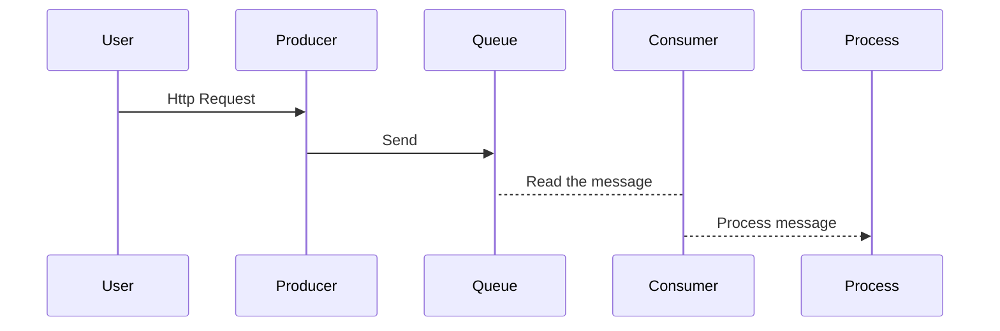
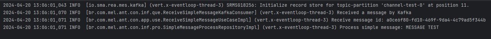

# Dynamic Queues

Este é um projeto Java desenvolvido utilizando a versão 17 da linguagem e o framework Quarkus.
O principal objetivo deste projeto é implementar dois sistemas de filas de mensagens (mensageria) de forma dinâmica:
Kafka e
RabbitMQ.
Para alcançar isso, aplicamos conceitos da arquitetura hexagonal (Port and Adapters), o que nos permite trocar
facilmente
a tecnologia ou o comportamento da aplicação apenas informando a escolha através de uma variável de ambiente.

## Requisitos

- Java 17 ou superior
- Apache Maven 3.6.3 ou superior
- Quarkus 3.9.1
- Docker*

*'Caso queira subir todos os recursos necessários localmente

## Instalação

1. Certifique-se de ter o Java 17 instalado corretamente em sua máquina.
2. Instale o Apache Maven seguindo as instruções em [Maven Installation Guide](https://maven.apache.org/install.html).
3. Clone este repositório em sua máquina local:

```bash
git clone https://github.com/antoniomellies/dynamic-queues
````

## Estrutura

Esse projeto possui 3 módulos, sendo eles:

1. dynamic-queue-core: Responsável por gerenciar interfaces e arquivos em comum das aplicações
2. dynamic-queue-producer: Responsável por produzir itens nas filas
3. dynamic-queue-consumer: Responsável por receber e processar itens das filas

## Compilação e Execução

1. Navegue até o diretório do projeto:

```bash
cd dynamic-queues
```

2. Compile o projeto utilizando o Maven:

```bash
mvn clean package
```

Inicie a aplicação 'dynamic-queue-producer':

```bash
cd dynamic-queues-consumer
java -jar target/dynamic-queues-producer-1.0.0.jar
```

Volte para o diretório principal do projeto:

```bash
cd ..
```

Inicie a aplicação 'dynamic-queue-consumer':

```bash
cd dynamic-queues-consumer
java -jar target/dynamic-queues-consumer-1.0.0.jar
```

## Ambiente

Para execução das aplicações é necessário que os serviços Kafka e/ou RabbitMQ estejam rodando.
As aplicações estão configuradas para serviços rodando localmente, caso você tenha esses serviços rodando em outro local
é possível configurar através de variáveis de ambiente.

### Variáveis

| Variável                | Valor padrão   | Descrição                         |
|-------------------------|----------------|-----------------------------------|
| KAFKA_BOOTSTRAP_SERVERS | localhost:9092 | Endereço do serviço Kafka         |
| RABBITMQ_HOST           | localhost      | Endereço host do serviço RabbitMQ |
| RABBITMQ_PORT           | 5672           | Porta de serviço RabbitMQ         |
| RABBITMQ_USERNAME       | guest          | Usuario do serviço RabbitMQ       |
| RABBITMQ_PASSWORD       | guest          | Senha do serviço RabbitMQ         |

### Docker Compose

Para facilitar os testes locais existe um arquivo de docker-compose.

1. Subindo os containers dos serviços:
```bash
docker-compose up -d
```

2. Verificando os containers:
```bash
docker ps
```

## Aplicações

Por padrão as aplicações producer e consumer rodam nas portas 8081 e 8080 respectivamente.

### Fluxo das aplicações



### Enviando mensagem para fila

```bash
curl -X POST --location "http://localhost:8081/simple-message" \
    -H "Content-Type: */*" \
    -d  '{
           "message": "MESSAGE TEST"
        }' 
```

### Alterando sistema de filas

Nesse projeto foi implementado dois sistemas de filas distintos, sendo eles Kafka e RabbitMQ. Podemos escolher o sistema
que queremos utilizar alterando a variavel de ambiente 'QUEUE_SYSTEM'.
Por padrão as aplicações utilizam [Kafka](https://kafka.apache.org/).

| Valores possíveis | Sistema de mensageria                 |
|-------------------|---------------------------------------|
| kafka             | [Kafka](https://kafka.apache.org/)    |
| rabbitmq          | [RabbitMQ](https://www.rabbitmq.com/) |

### Analisando resultado

Quando uma mensagem é enviada podemos analisar os logs das aplicações para verificar o envio,recebimento e processamento
da mensagem.

- Log na aplicação de envio de mensagem (Producer)
  

- Log na aplicação de recebimento e processamento da mensagem (Consumer)
  

## Contribuição

Sinta-se à vontade para contribuir com melhorias, reportar problemas ou enviar solicitações de pull request.

## License
MIT
